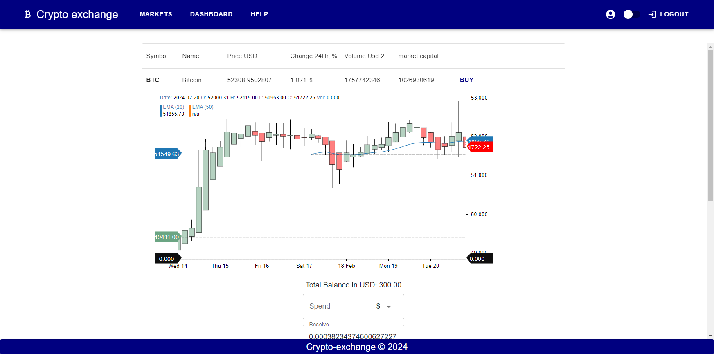
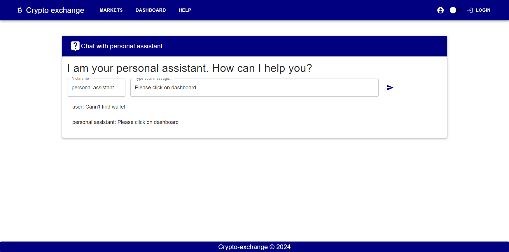

Crypto Exchange Platform a cutting-edge web application designed 
for cryptocurrency enthusiasts and traders.

Built on Next.js or seamless server-side rendering and optimal user experience,
our platform offers real-time currency charts, buying and selling functionalities,
live chat support using Socket.IO and a secure user authentication system. 
With a robust backend powered by Node.js, we ensure fast, secure, and reliable service.

Features

Real-Time Currency Charts: Stay updated with the latest trends in cryptocurrency through our real-time currency charts. 
Make informed decisions with up-to-date data visualizations.
Buy and Sell Cryptocurrency: Our platform supports seamless transactions, allowing users to buy and sell cryptocurrencies with ease.
Live Chat Support: Have questions or need assistance?
Our live chat feature, powered by Socket.IO, ensures you're always connected and can receive prompt support.
User Authentication: Secure login and registration process with email and password. 
Protect your account and transactions with our robust authentication system.
Responsive Design: Whether you're trading on a desktop or on the go with your mobile device,
our platform's responsive design adapts to your screen size for optimal viewing and interaction.

Getting Started

To get started with the Crypto Exchange Platform, follow these installation steps.

Prerequisites

Node.js (LTS version recommended)
npm or yarn
Installation
Clone the repository:
bash
Copy code
git clone https://github.com/hotolla/crypto-site
Navigate to the project directory:
bash
Copy code
cd crypto-exchange-platform
Install dependencies:
bash
Copy code
npm install
or
yarn install

Run the development server:

bash
Copy code
npm run dev or
yarn dev
Open http://localhost:3000 with your browser to see the result.

Technologies Used

Next.js: Frontend framework for React, providing server-side rendering and generating static websites.
Node.js: JavaScript runtime built on Chrome's V8 JavaScript engine, used for building the backend.
Socket.IO: Enables real-time, bidirectional, and event-based communication between web clients and servers.
Other Libraries: Various other libraries and tools are used for UI components, state management, styling, and more.